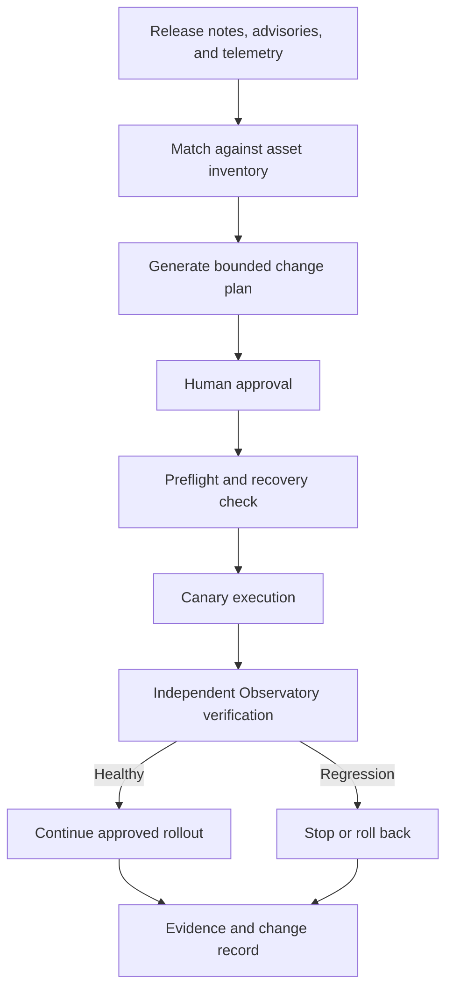

# The Bridge — Controlled Infrastructure Change Plane

**Status:** Planned architecture  
**Last reviewed:** 2026-09-14  
**Evidence label:** Planned

The Bridge is the planned MidnightLabs control plane for turning verified operational intelligence into narrow, authorized, observable, and reversible infrastructure changes.

Its purpose is not to create a universal remote shell. Its purpose is to reduce the distance between discovering that a change matters and executing that change safely across systems with different management interfaces.

> **The Bridge acts. The Observatory witnesses. The operator authorizes.**

## Problem

MidnightLabs receives useful signals from vendor release notes, vulnerability advisories, system inventories, and Observatory telemetry. Today, acting on those signals still requires separate manual sessions across virtualization, storage, firewall, operating-system, container, and network-device interfaces.

The Bridge will provide one controlled workflow for answering:

1. Does this advisory or update apply to an asset we operate?
2. Is the affected component reachable or exposed?
3. Is the asset healthy enough to change?
4. Is a valid recovery point available?
5. What dependencies could be interrupted?
6. What exact action is authorized?
7. What evidence will prove success?
8. What condition must stop or reverse the rollout?

## System boundaries

The Bridge is separate from both AIDA and the Observatory.

| Component | Responsibility | Prohibited role |
|---|---|---|
| Operator | Approves consequential state changes | Silent delegation of unrestricted authority |
| AIDA | Interprets evidence and proposes bounded plans | Direct, unapproved infrastructure mutation |
| Bridge | Executes approved actions through restricted adapters | General-purpose autonomous shell access |
| Observatory | Independently measures health and verifies outcomes | Performing the changes it evaluates |
| Git and evidence storage | Preserve plans, decisions, results, and sanitized proof | Storing credentials or live operational secrets |

This separation prevents the system that performs a change from being the sole authority on whether the change succeeded.

## Change pipeline

No consequential action should skip applicability, approval, recovery, and verification merely because the underlying command is familiar.

## Adapter model

The Bridge will use platform-specific adapters rather than pretending every system has the same update mechanism.

| Asset class | Planned adapter behavior |
|---|---|
| Linux hosts and VMs | Inventory packages, simulate changes, create or verify recovery points, apply approved packages, handle reboots, and run service checks |
| Proxmox | Inspect repositories and packages, account for guest and host dependencies, coordinate maintenance state, and verify compute and storage health |
| TrueNAS/ZFS | Preserve configuration state, use supported management interfaces, verify pools and shares, and validate dependent clients |
| OPNsense | Preserve configuration state, stage supported updates, protect the management lifeline, and validate routing, firewall, VPN, and telemetry behavior |
| Containers | Resolve pinned image digests, preserve configuration, recreate narrowly, and verify declared health checks |
| Managed switches and appliances | Detect version and exposure; use guided or manual execution when safe automation interfaces are unavailable |
| Observatory services | Update components without allowing them to self-certify; use external health and ingestion checks |

Adapters must expose named operations with documented inputs, outputs, permissions, failure modes, and rollback behavior. They must not accept arbitrary commands from an AI-generated plan.

## Authorization classes

Bridge actions should be classified before execution:

- **Observe** — inventory, version checks, health checks, dependency discovery, and dry runs.
- **Prepare** — download artifacts, validate signatures or hashes, create change plans, and confirm recovery readiness.
- **Routine change** — previously tested, low-blast-radius actions within an approved maintenance policy.
- **Consequential change** — firewall, identity, storage, hypervisor, management-plane, reboot, firmware, or multi-system actions requiring explicit approval.
- **Break-glass** — emergency recovery under a separately controlled operator procedure.

AIDA may recommend any class. It does not grant itself authority to execute one.

## Required controls

The Bridge must preserve the MidnightLabs doctrine:

- **Explicit intent:** every action has a stated reason and target.
- **Least privilege:** each adapter receives only the permissions required for its named operations.
- **Allowlists:** targets, operations, packages, repositories, and maintenance scopes are constrained.
- **Human approval:** consequential changes require an operator decision tied to an immutable plan identifier.
- **Recovery before mutation:** backup, snapshot, configuration export, or documented rebuild path is verified before change.
- **Canary before fleet:** one suitable target is changed and observed before a broader rollout.
- **Independent verification:** the Observatory evaluates health from outside the changed component.
- **Fail closed:** missing evidence, stale inventory, unavailable recovery, or ambiguous scope blocks execution.
- **Auditability:** inputs, approval, commands or API calls, outputs, timestamps, verification, and disposition are recorded.
- **Secret separation:** credentials remain in a dedicated secret store and never enter prompts, plans, Git, or public logs.
- **No unrestricted shell:** an agent cannot convert the Bridge into general administrative access.

## Initial implementation phases

### Phase 0 — Architecture and inventory

- Establish a machine-readable asset inventory.
- Record platform, role, lifecycle state, update channel, management method, dependency class, and recovery method.
- Define a change-plan schema and evidence schema.
- Keep all actions read-only.

### Phase 1 — Read-only operations

- Collect installed versions and available updates.
- Correlate assets with vendor advisories and the CISA Known Exploited Vulnerabilities catalog.
- Produce a locally relevant remediation queue.
- Export evidence for operator review.

### Phase 2 — Preparation adapters

- Validate configuration backups and snapshots.
- Run package simulations and preflight health checks.
- Retrieve approved artifacts and verify provenance.
- Generate exact, bounded execution plans without applying them.

### Phase 3 — Canary-controlled changes

- Begin with low-risk Linux VM package updates.
- Require explicit approval.
- Apply to one canary target.
- Use Observatory health signals to determine whether the plan may continue.
- Exercise stop and rollback behavior deliberately.

### Phase 4 — Platform adapters

Add Proxmox, TrueNAS, OPNsense, containers, and suitable network appliances individually. Each adapter must pass its own failure, recovery, and evidence tests before being promoted.

### Phase 5 — Policy-bound orchestration

Permit narrowly defined routine changes under pre-approved policy. Consequential infrastructure remains approval-gated. Expand authority only after the previous scope has demonstrated reliable rollback and trustworthy evidence.

## Minimum viable Bridge

The first useful Bridge does not update the entire lab. It:

1. reads an asset inventory;
2. gathers installed Linux package versions;
3. compares them with available security updates and applicable exploitation intelligence;
4. produces a bounded plan;
5. verifies a recovery point;
6. waits for approval;
7. updates one disposable or recoverable VM;
8. asks the Observatory for independent health evidence; and
9. records the complete result.

That vertical slice proves the control model before adding high-impact systems.

## Success criteria

The Bridge is ready to expand when MidnightLabs can demonstrate:

- an advisory matched correctly to a real local asset;
- an irrelevant advisory rejected with evidence;
- an ambiguous or unsafe change blocked;
- an approved canary updated successfully;
- a failed verification stopping the rollout;
- a rollback or known-good rebuild;
- complete audit evidence without exposed secrets; and
- independent Observatory confirmation of the final state.

## Public/private documentation boundary

This document describes the public architecture and safety doctrine.

Private operations documentation must hold exact management paths, credentials, secrets, internal addressing where sensitive, adapter permissions, live inventories, recovery material, detailed access-control rules, and executable production procedures. Public artifacts may include sanitized schemas, reusable adapters, simulations, test evidence, and retrospectives after review under the MidnightLabs publication standard.
