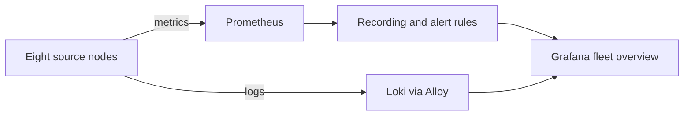

# MidnightLabs Observatory

**Status:** Operational evidence, sanitized for public release  
**Evidence date:** 2026-09-21

Observatory is the telemetry and verification plane for MidnightLabs. It centralizes metrics and logs, evaluates fleet and source-specific health policy, and presents the resulting state without receiving authority to change the systems it observes.

> The operator authorizes. The infrastructure acts. Observatory witnesses.

## Verified state

- Eight monitored nodes
- Sixteen healthy Prometheus targets at final verification
- Ten recording rules and 33 alerting rules
- One provisioned Grafana dashboard with 17 panels
- Thirty-day Loki retention and fifteen-day Prometheus retention
- Metrics, journald, syslog, application-log, SNMP, and backup-evidence lanes
- Recovery-aware Home Assistant telemetry through a custom local app

The counts above describe the verified September 21 state. They are evidence, not a promise that a later deployment will have the same inventory.

## Architecture

Prometheus records current and historical health. Alloy receives local journal entries, network syslog, and file-based application logs before forwarding them to Loki. Grafana consumes both stores. Source-specific collectors expose operational state that generic host metrics cannot express, including backup evidence, expected guest state, dependency listeners, and recovery artifacts.

## Repository map

| Path | Purpose |
|---|---|
| `deploy/` | Sanitized Compose layers for the central stack |
| `config/prometheus/` | Scrape topology and policy rules |
| `config/grafana/` | Datasource, provider, and dashboard provisioning |
| `config/alloy/` | Central log receivers and labeling pipeline |
| `config/loki/` | Local filesystem storage and retention policy |
| `config/snmp-exporter/` | Switch module generator and generated module |
| `sources/home-assistant/addon/` | Custom Home Assistant observability app v0.1.2 |
| `SOURCE-MATRIX.md` | Source-by-source telemetry coverage |
| `AUDIT-2026-09-21.md` | Evidence ledger, validation, gaps, and findings |

## Public configuration boundary

These files are sanitized operational evidence. Documentation hostnames replace live addresses, generic network labels replace internal VLAN identifiers, and deployment-specific group IDs are supplied through environment variables. Credentials, tokens, SNMP authentication material, runtime data, backups, logs, and rollback copies are excluded.

The examples deliberately preserve service relationships, labels, ports, retention, resource limits, queries, and policy logic. They are not a drop-in copy of the private deployment.

Required local material includes:

- a Grafana admin password supplied through the environment;
- a Home Assistant bearer token mounted from `secrets/`;
- SNMP exporter authentication material mounted separately;
- host-specific Docker and journal group IDs;
- local name resolution or target substitutions for the `.example.internal` names.

## Validation performed

- Compose definitions reconciled against the running containers
- Prometheus configuration validated with `promtool`
- Both rule files validated with `promtool`
- Grafana dashboard JSON parsed and provisioned successfully
- Home Assistant app Python compiled successfully
- All sixteen active targets reached `up`
- Authoritative Prometheus alert state reached zero pending or firing alerts
- Loki source identity and source-timestamp preservation were verified
- Secret-name, credential-pattern, and live-address scans were run before publication

See the [audit](./AUDIT-2026-09-21.md) for limitations and remaining work.
